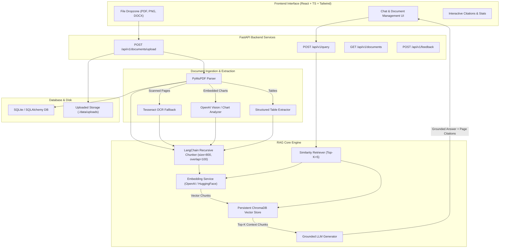

# Multimodal Document Intelligence & RAG Assistant

An enterprise-grade, full-stack **Retrieval-Augmented Generation (RAG)** assistant that parses complex documents (PDFs, scanned PDFs, images, DOCX, reports, resumes, invoices), extracts text/OCR/tables/charts, embeds and indexes chunks in persistent ChromaDB, and generates strictly grounded answers backed by page-level citations.

---

## 1. System Architecture & RAG Pipeline



---

## 2. Key Features

* **Real RAG Engine**: Performs Document Ingestion → Chunking → Vector Embeddings → Similarity Search → Context Retrieval → Grounded LLM Generation.
* **Multimodal Processing**: Supports selectable text PDFs, scanned PDFs (via Tesseract OCR), DOCX files, images/charts (via Vision VLM descriptions), and structured markdown table parsing.
* **Strict Page-Level Citations**: Answers return exact source citations indicating the document name and page number (e.g. `Annual_Report.pdf — Page 24`).
* **Multi-Document Analysis**: Select multiple uploaded documents to perform comparative cross-document analysis.
* **Modular Vector Storage**: ChromaDB backend designed behind clean interfaces to allow swapping vector DBs (e.g. Qdrant, Milvus, PGVector).
* **Configurable Embedding Models**: Supports both OpenAI (`text-embedding-3-small`) and local HuggingFace embeddings (`all-MiniLM-L6-v2`).
* **Interactive ChatGPT UI**: Built with React, TypeScript, Tailwind CSS, real-time status badges, sample question shortcuts, and 👍/👎 feedback submission.

---

## 3. Technology Stack

* **Backend**: Python 3.11+, FastAPI, Pydantic v2, SQLAlchemy 2.0.
* **AI & RAG**: LangChain, ChromaDB, OpenAI API, HuggingFace Sentence Transformers.
* **Document Processing**: PyMuPDF (`fitz`), Tesseract OCR, Pillow, OpenCV, `python-docx`, pandas.
* **Database**: SQLite (SQLAlchemy ORM modularized for easy PostgreSQL migration).
* **Frontend**: React 18, TypeScript, Tailwind CSS, Lucide Icons, Axios.
* **Containerization**: Docker & Docker Compose.

---

## 4. API Endpoints Reference

| Method | Endpoint | Description |
| :--- | :--- | :--- |
| `GET` | `/api/v1/health` | Check API and SQLite DB health status |
| `POST` | `/api/v1/documents/upload` | Upload PDF, PNG, JPG, or DOCX document |
| `GET` | `/api/v1/documents` | List all uploaded documents with status |
| `GET` | `/api/v1/documents/{id}` | Get specific document details |
| `DELETE` | `/api/v1/documents/{id}` | Delete document and clean up vector embeddings |
| `POST` | `/api/v1/query` | Submit question to RAG pipeline, receive answer + citations |
| `POST` | `/api/v1/chat` | Alias for query endpoint for chat sessions |
| `POST` | `/api/v1/feedback` | Log user feedback rating (Helpful / Not Helpful) |
| `GET` | `/api/v1/feedback/stats` | Retrieve dashboard metrics and feedback counts |

---

## 5. Quickstart & Installation

### Option A: Running with Docker Compose (Recommended)

```bash
# 1. Clone or navigate to project workspace
cd /Users/abhijeet05/.gemini/antigravity/scratch/multimodal_rag_assistant

# 2. Copy environment template
cp .env.example .env

# 3. Build and launch services
docker compose up --build
```

Access Points:
* **Frontend Dashboard**: `http://localhost:3000`
* **FastAPI Swagger Docs**: `http://localhost:8000/docs`
* **Backend Health Check**: `http://localhost:8000/api/v1/health`

---

### Option B: Running Locally

#### 1. Backend Setup
```bash
cd backend
python3 -m venv venv
source venv/bin/activate
pip install -r requirements.txt

# Start Uvicorn server
uvicorn app.main:app --reload --host 0.0.0.0 --port 8000
```

#### 2. Frontend Setup
```bash
cd frontend
npm install
npm run dev
```

---

## 6. Running Tests

Run backend unit and end-to-end integration tests:

```bash
cd backend
pytest tests/
```

Test suite includes:
* `test_health.py`: Validates API endpoints and database ping.
* `test_e2e_rag.py`: Automated end-to-end test creating synthetic sample PDF, parsing text, chunking, embedding into ChromaDB, querying RAG engine, and verifying answer citation metadata.
